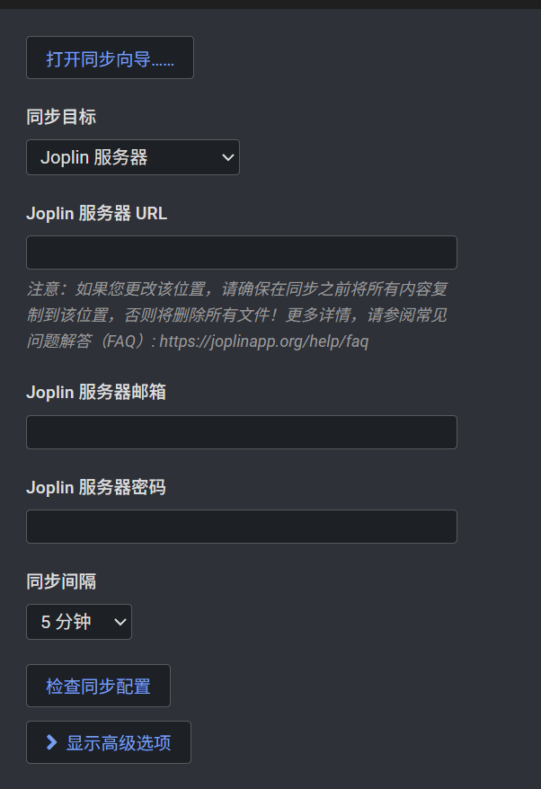

# Joplin笔记云端服务

---

- 服务器Database配置：

  ```shell
  #1、创建Joplin目录
  sudo mkdir -p /opt/joplin/data/postgres
  cd /opt/joplin
  sudo chown -R $USER:$USER /opt/joplin
  #2、编辑env文件
  sudo vim /opt/joplin/.env
  POSTGRES_PASSWORD=在这里输入一个强密码
  POSTGRES_USER=joplin
  POSTGRES_DATABASE=joplin
  POSTGRES_PORT=5432
  
  APP_PORT=22300
  APP_BASE_URL=http://服务器IP地址:22300
  
  DB_CLIENT=pg
  POSTGRES_HOST=db
  #3、创建 Docker Compose
  sudo vim /opt/joplin/docker-compose.yml
  services:
  
    db:
      image: postgres:16
      container_name: joplin-db
  
      restart: unless-stopped
  
      environment:
        POSTGRES_PASSWORD: ${POSTGRES_PASSWORD}
        POSTGRES_USER: ${POSTGRES_USER}
        POSTGRES_DB: ${POSTGRES_DATABASE}
  
      volumes:
        - ./data/postgres:/var/lib/postgresql/data
  
      networks:
        - joplin
  
  
    app:
      image: joplin/server:3.7.1
      container_name: joplin-server
  
      depends_on:
        - db
  
      restart: unless-stopped
  
      ports:
        - "22300:22300"
  
      environment:
        APP_PORT: ${APP_PORT}
        APP_BASE_URL: ${APP_BASE_URL}
  
        DB_CLIENT: ${DB_CLIENT}
  
        POSTGRES_PASSWORD: ${POSTGRES_PASSWORD}
        POSTGRES_DATABASE: ${POSTGRES_DATABASE}
        POSTGRES_USER: ${POSTGRES_USER}
        POSTGRES_PORT: ${POSTGRES_PORT}
        POSTGRES_HOST: ${POSTGRES_HOST}
  
      networks:
        - joplin
  
  
  networks:
    joplin:
  #4、启动Docker
  sudo docker compose pull
  sudo docker compose up -d
  sudo docker compose ps
  #5、Docker日志查看
  sudo docker compose logs -f app
  sudo docker compose logs -f db
  ```

- Jpolin服务配置：

  1. 浏览器打开htpp://服务器IP:22300，并输入以下信息登录Joplin服务

     >**注意：**在第一次登陆后记得立即修改管理账户密码

     - 账号：admin@localhost
     - 密码：admin

  2. 创建专门用于同步Joplin笔记的账号

     - 账号：邮箱
     - 密码：强密码

- Joplin同步配置：

  
  
  
