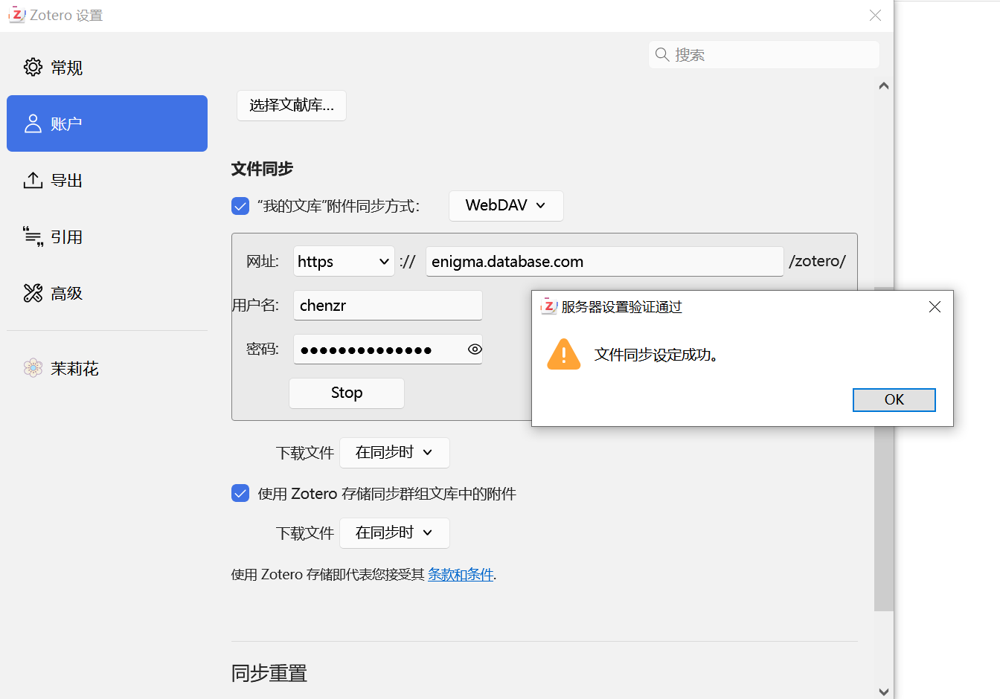
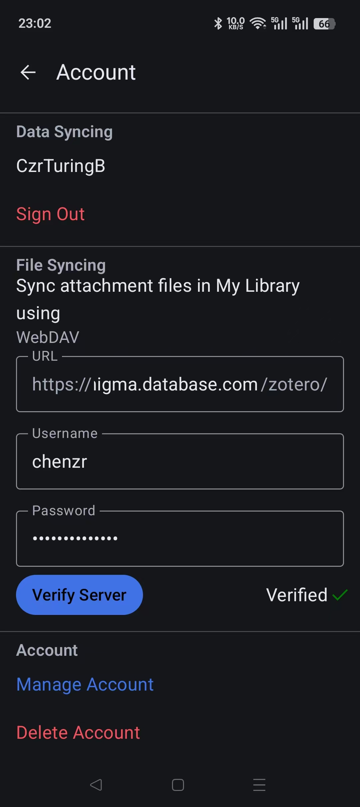

# Zetro文件同步服务

---

- 服务器Database配置：

  ```shell
  #1、创建Joplin目录
  sudo mkdir -p /opt/zotero-webdav
  sudo chown -R $USER:$USER /opt/zotero-webdav
  ls -ld /opt/zotero-webdav
  cd /opt/zotero-webdav
  #2、创建 config.yml
  sudo vim config.yml
  address: 0.0.0.0
  port: 6065
  
  tls: false
  
  prefix: /
  
  directory: /data
  
  users:
    - username: 账户名称
      password: 账户密码
      permissions: CRUD
  #3、创建 Docker Compose
  sudo vim docker-compose.yml
  services:
    zotero-webdav:
      image: hacdias/webdav:latest
      container_name: zotero-webdav
      restart: unless-stopped
  
      ports:
        - "8090:6065"
  
      volumes:
        - /opt/zotero-webdav/config.yml:/config.yml:ro
        - /opt/zotero-webdav/data:/data
  
      command: ["-c", "/config.yml"]
  #3、启动Docker
  sudo docker compose pull
  sudo docker compose up -d
  sudo docker compose ps
  #5、Docker日志查看
  sudo docker compose logs -f zotero-webdav
  docker ps --format "table {{.Names}}\t{{.Image}}\t{{.Ports}}"
  ```
  
- Zotero配置：

  >**ChenZR：**提前下载好Zetro各个系统下的应用软件，另外由于安卓端对于HTTP服务存在限制因此在体验Zotero配置前需提前配置好Caddy
  
  - PC端：
  
    
  
  - 安卓端：
  
    
  

