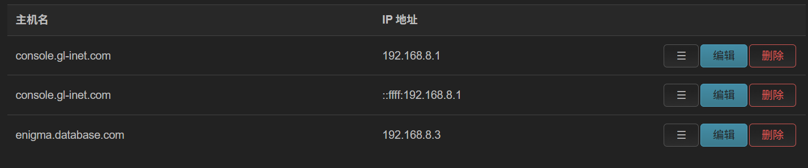
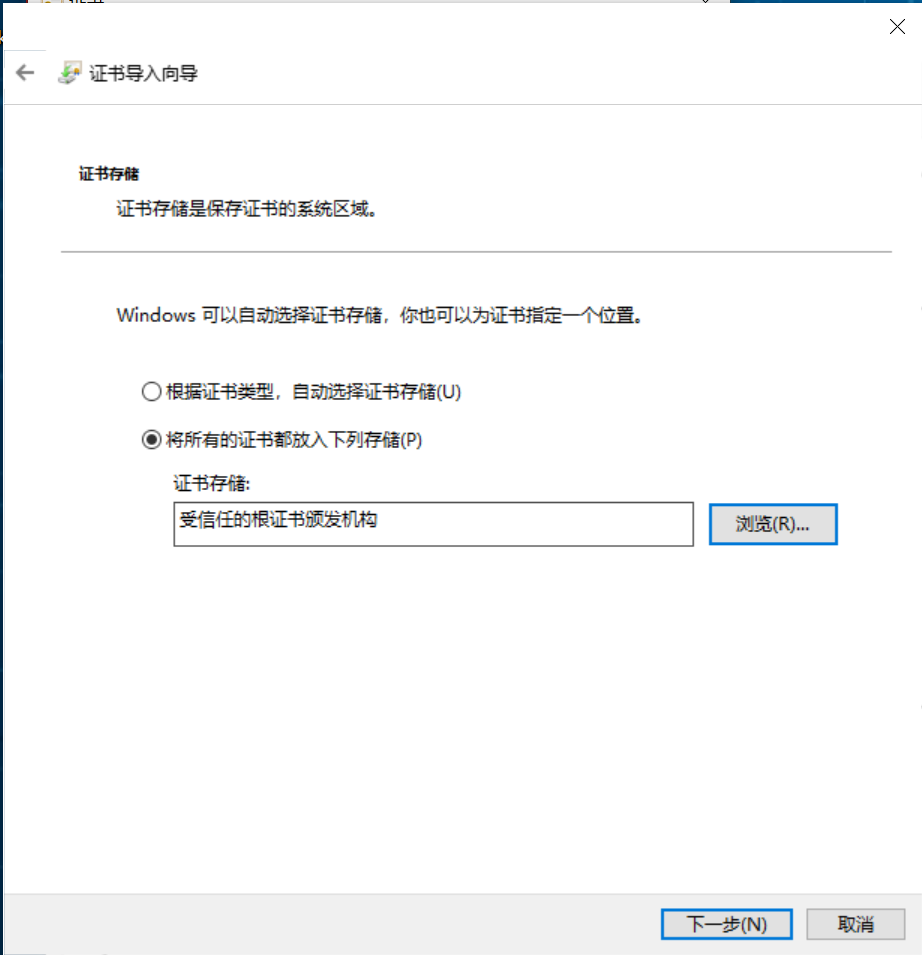

# Caddy HTTPS服务配置

---

## 第一章	初始配置

- 服务器Database配置：

  ```shell
  #1、创建Caddy目录
  sudo mkdir -p /opt/caddy
  sudo chown -R $USER:$USER /opt/caddy
  ls -ld /opt/caddy
  cd /opt/caddy
  #2、创建 Caddyfile
  sudo vim /opt/caddy/Caddyfile
  enigma.home.com {
      tls internal
      reverse_proxy host.docker.internal:7575
  }
  #3、创建 Docker Compose
  sudo vim docker-compose.yml
  services:
    caddy:
      image: caddy:2
      container_name: caddy
      restart: unless-stopped
  
      ports:
        - "443:443"
  
      extra_hosts:
        - "host.docker.internal:host-gateway"
  
      volumes:
        - ./Caddyfile:/etc/caddy/Caddyfile:ro
        - ./data:/data
        - ./config:/config
  #4、启动Docker
  sudo docker compose pull
  sudo docker compose up -d
  sudo docker compose ps
  #5、Docker日志查看
  sudo docker compose logs -f caddy
  docker ps --format "table {{.Names}}\t{{.Image}}\t{{.Ports}}"
  #6、CA证书生成并下载下来传给手机和电脑
  docker cp caddy:/data/caddy/pki/authorities/local/root.crt /opt/caddy/enigmaServer.crt
  ls -l /opt/caddy/enigmaServer.crt
  openssl x509 -in /opt/caddy/enigmaServer.crt -noout -subject -issuer -fingerprint -sha256
  #7、网络测试
  curl -vk --resolve enigma.home.com:443:127.0.0.1 https://enigma.home.com/
  ```

- 路由器配置：进入到路由器配置页面----网络----主机名映射----添加域名对应的IP：

  

- Window安装CA证书：双击证书点击安装----存储位置选择本地计算机----将所有证书都放入以下存储----受信任的根证书颁发机构

  

  ```shell
  #1、管理员权限打开PowerShell
  notepad C:\Windows\System32\drivers\etc\hosts
  #2、在文件最后一行添加
  192.168.8.3 enigma.zotero.com
  #3、验证网络配置
  curl.exe -vk https://enigma.zotero.com/
  ```

- Android：在设置中搜索----CA证书----选择生成的CA证书文件----安装即可

### 第二章	日常维护

- 添加新的域名解析：

  1. 更改Caddy配置文件：

     ```shell
     sudo vim /opt/caddy/Caddyfile
     enigma.zotero.com {
         tls internal
         reverse_proxy host.docker.internal:8090
     }
     enigma.joplin.com {
         tls internal
         reverse_proxy host.docker.internal:22300
     }
     cd /opt/caddy
     docker compose restart caddy
     ```

  2. 更改路由器主机映射：进入到路由器配置页面----网络----主机名映射----添加域名对应的IP

  3. 更改Windows主机映射：

     ```shell
     #1、管理员权限打开PowerShell
     notepad C:\Windows\System32\drivers\etc\hosts
     #2、在文件最后一行添加
     192.168.8.3 enigma.zotero.com
     192.168.8.3 enigma.joplin.com
     #3、验证网络配置
     curl.exe -vk https://enigma.zotero.com/
     curl.exe -vk https://enigma.joplin.com/
     ```

     