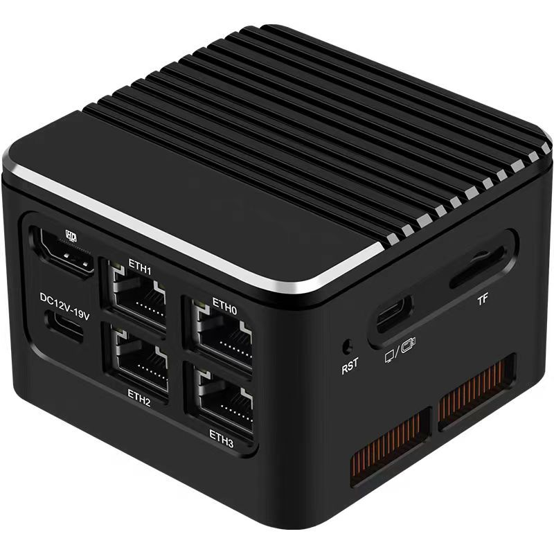
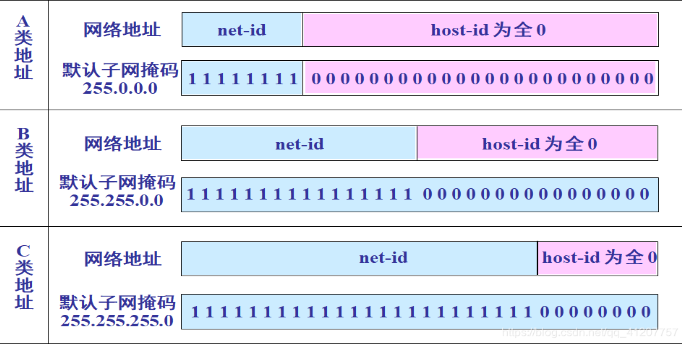
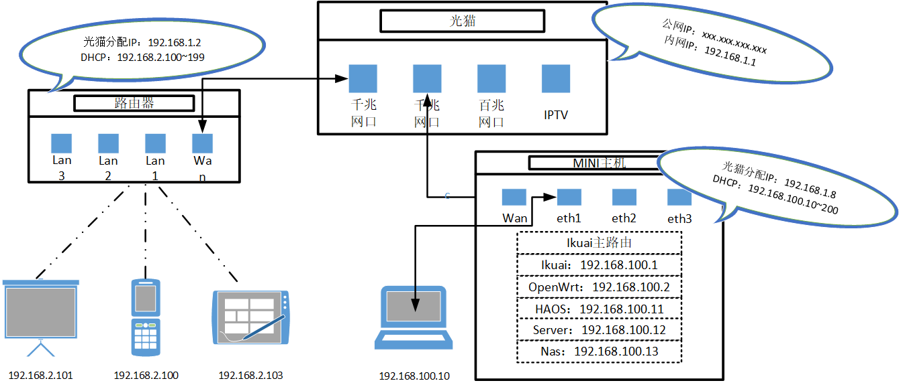

# EnigmaPVE

----

## 系列文章



>**ChenZR：**
>
>>​	由于我近期研究生学习生活中遇到了一些事情，导致之前ESP32的学习任务发生了中断，并且最近实在是调整不过来学习状态，因此想要临时更换一下学习方向，消遣一下时光。这次打算折腾一下All in one，智能家居是一个我非常感兴趣的方向（尽管这是与我研究生专业背道而驰的），我一直想要打造一套属于自己的智能家居体系，当然这是一个听起来十分远大的理想，就近期而言我想要打造一个智能家居式的工作桌面：无论是学校的工位还是家里的书桌都是只有一个网口，但是目前我有很多的嵌入式机器需要通过网口链接网络，因此需要一个交换机或者软路由将网口进行拓展。另一方面，就我个人而言我比较喜欢收集各类的电子书、壁纸、笔记、代码、视频等相关资料，这些资料会占据大量的电脑、平板的存储空间，而移动硬盘每次使用起来也不是很方便网络硬盘也存在一定程度上的空间限制与网速限制，因此我想要搭建一个Nas(成品的Nas太贵了，实在是买不起，而且我还是喜欢折腾对于成品Nas的需求并不是很高)。最后，想要在机器上跑一些相关代码和服务。
>>
>>​	根据上述的需求进行整理，我入手了一个X86的mini主机，其不仅具有非常高的颜值并搭载了一块低功耗CPU（N100），并拥有4个2.5G网口，支持HDMI、Typec音视频输出，16G的内存与1TB的存储空间……
>

---



## 第一部分	主机BIOS

### 第一章	配置信息

- 硬件接口：
  - 音频接口
  - 4×2.5G网口
  - 2×USB3.1接口
  - TF卡接口
  - TypeC视频接口
  - HDMI2.0视频接口
  - TypeC供电接口
  - 开关按键
  - RST复位按键
  - 状态指示灯
- 硬件配置：
  - CPU：Intel® Processor N100 
  - 内存：16GB
  - 储存：1TB （M.2 2242 M-KEY NVME SSD PCIE x2/SATA协议）

### 第二章	基础操作

- 进入Bios的方法：
  1. 连接HDMI线至屏幕；
  2. 连接ETH2网口线至路由器
  3. 连接鼠标和键盘
  4. 通电按下开机键后连续按下Del键即可进入BIOS
- 选择启动盘的方法：
  1. 连接HDMI线至屏幕；
  2. 连接ETH2网口线至路由器
  3. 连接鼠标和键盘
  4. 通电按下开机键后连续按下F7键即可进入启动项选择界面

## 第二部分	PVE虚拟机

>**ChenZR：**
>
>>- 什么是虚拟机？
>>
>>  ​	根据我曾经的学习经历来说，共在两个地方基础过“虚拟机”：一个是在学习Linux系统时，在Windows操作系统下安装VMware运行Ubuntu操作系统，一个是在学习Java语言时，配置Java虚拟机编译运行Java代码(这个虚拟机实现了Java语言的跨平台特性)。虚拟机即通过软件模拟具有完整硬件系统功能的运行在一个完全隔离环境中的完整计算机系统。常见的虚拟机有VMware、VirtualBox等，这类虚拟机通常安装在Windows操作系统之上，相较于安装双系统的方式而言，其以牺牲一部分性能为代价，从而可使用多个系统的软件生态。
>>
>>  ​	除了上述虚拟机外，还有一些虚拟机可直接将轻量级虚拟机管理系统部署在一个硬件设备上，并支持同时运行多个虚拟系统，实现所谓的“All in one”。这类虚拟机主要有PVE、ESXI两类。
>>
>>- 什么是PVE？
>>
>>  ​	Proxmox Virtual Environment（简称PVE）是一个基于 Linux 的开源虚拟化管理平台，用于创建、管理和维护虚拟机（VM）和容器（LXC）。它底层基于 Debian 系统，集成了 KVM 完整虚拟化技术和 LXC轻量级容器技术，使我们既能运行完整隔离的操作系统（如 Windows 或 Linux 虚拟机），也能快速部署轻量化 Linux 服务容器。PVE 提供直观的 Web 管理界面，可方便地进行虚拟机创建、启动、停止、快照、备份和迁移，同时支持存储管理（如 ZFS、Ceph）、网络配置（桥接、NAT、防火墙）和集群高可用（HA）功能。通过 PVE，我们可以在同一台物理服务器上高效运行多个隔离的虚拟环境，实现资源最大化利用，同时保证安全性和灵活性，是小型家庭实验室、企业服务器虚拟化和云环境部署的理想选择。
>>
>>- 什么是ESXI？
>>
>>  ​	VMware ESXi 是 VMware 公司推出的一款企业级裸机虚拟化（Bare-Metal Hypervisor）软件，用于在物理服务器上高效运行多个虚拟机。ESXi 直接安装在服务器硬件上，不依赖任何操作系统，因此虚拟机性能接近物理机，同时系统本身体积小、攻击面少，安全性和稳定性很高。它允许每台虚拟机独立运行操作系统（如 Windows、Linux 等），并提供快照、克隆、启动/停止管理等功能。结合 VMware 的管理工具（如 vSphere 或 vCenter），ESXi 支持虚拟机热迁移（vMotion）、高可用性（HA）、分布式资源调度（DRS）等企业级特性，非常适合生产环境和数据中心使用。相比开源平台 PVE，ESXi 更偏向商业企业市场，功能强大但部分高级功能需要授权，而普通虚拟机管理则通过直观的 Web 或客户端界面完成。

### 第一章	PVE系统安装

- 启动盘软件：[balenaEtcher - Flash OS images to SD cards & USB drives](https://etcher.balena.io/#download-etcher)

- 系统镜像：[Download Proxmox software, datasheets, agreements](https://www.proxmox.com/en/downloads)

- 操作步骤：

  1. 将U盘格式化为FAT32格式，然后使用镜像烧录工具将刚才下载的镜像文件烧录到U盘中去，烧录完成后弹出U盘。

  2. 将U盘插到迷你主机上，链接电源、键盘、鼠标、屏幕。开机，不停的按DEL键进入bios，在启动项中设置U盘启动为首选项，保存配置退出重启机器即可。

  3. 重启后进入到PVE安装引导界面，根据进行PVE系统的安装，相关内容填写示例如下所示：

     >- 烧录硬盘：我的mini主机只有一个硬盘，因此默认即可
     >- 国家：China
     >- 地区：Asia/shanghai
     >- 键盘：U.S Keyboard
     >- 密码：即root用户登录密码
     >- 邮箱：根据自己邮箱填写即可，我的邮箱为ChenZR20010509@outlook.com
     >- 网卡选择：我的mini主机有四个网卡，这里我选择网卡二（enp2s0）
     >- 域名：随便填写一个即可
     >- IP地址：我设置为192.168.100.254/24
     >- Gatewy：我设置为192.168.100.1
     >- DNS server：我设置为1.1.1.1

  4. 依据引导界面填写相关信息后进行PVE系统的安装，安装完成后根据提示拔出U盘重启机器。

  5. 使用网线链接小主机和自己的电脑，打开自己电脑的网络适配器设置界面，设置以太网的属性，双击Internet网络协议版本4（IPV4）属性：

     >- IP地址：192.168.100.xxx(除去254其他都行)
     >- 子网掩码：255.255.255.0

  6. 到这一步我们就可以通过在网页上输入192.168.100.254:8006访问PVE的管理后台，同时我们也可以使用Putty工具、WinScp工具SSH访问我们的mini主机。

     >- 用户名：root
     >- 密码：安装PVE时自己设置的密码

  7. OK，PVE管理系统安装完成！！！

### 第二章	管理信息

- PVE管理地址：192.168.100.254:8006
- PVE用户名：root

### 第三章	PVE系统使用

#### 第一节	硬件直通配置

- 硬件直通：

  >​	首先我们知道虚拟系统要么运行在底层操作系统的虚拟管理软件中，要么运行在诸如PVE的虚拟机管理系统软件中，其使得多个操作系统可以部署在一个设备，并且每个操作系统都可以通过虚拟接口访问硬件设备。在All in one的某些场景中可能有且只有一个操作系统需要使用某个硬件设备，其余操作系统并不需要使用这个设备，那么我们可以通过硬件直通操作使这个操作系统直接控制硬件设备，这个操作就是硬件直通。直通给某个系统的硬件设备，不能在被其他虚拟系统访问。

- 硬件直通配置：

  1. 使用winscp软件连接PVE系统

  2. 修改grub文件：

     ```shell
     vim /etc/default/grub
     #将GRUB_CMDLINE_LINUX_DEFAULT="quiet"修改为
     GRUB_CMDLINE_LINUX_DEFAULT="quiet intel_iommu=on iommu=pt"
     ```

  3. 修改pve-blacklist.conf文件：

     ```shell
     vim /etc/modprobe.d/pve-blacklist.conf
     #文件末尾增加
     blacklist i915
     blacklist snd_hda_intel
     options vfio_iommu_type1 allow_unsafe_interrupts=1
     ```

  4. 内核模块加载：

     ```shell
     echo -e "vfio\nvfio_iommu_type1\nvfio_pci\nvfio_virqfd" >> /etc/modules
     update-grub
     update-initramfs -u -k all
     ```

  5. 重启PVE虚拟机：

     ```shell
     reboot
     ```

#### 第二节	PVE镜像源修改

- 设置PVE系统的DNS【PVE----设置----网络----PVE】：

  ```
  @搜索域：czrturingb.com
  @DNS服务器1：10.0.0.1
  @DNS服务器2：223.5.5.5
  @DNS服务器3：119.29.29.29
  ```

- 测试网络链接状态：

  ```shell
  ping baidu.com
  ```

- SSH链接PVE命令行控制系统：

  ```shell
  #修改基础系统（Debian）源
  sed -i 's|^deb http://ftp.debian.org|deb https://mirrors.ustc.edu.cn|g' /etc/apt/sources.list
  sed -i 's|^deb http://security.debian.org|deb https://mirrors.ustc.edu.cn/debian-security|g' /etc/apt/sources.list
  #修改 Proxmox 源
  echo "deb https://mirrors.ustc.edu.cn/proxmox/debian/pve bookworm pve-no-subscription" > /etc/apt/sources.list.d/pve-no-subscription.list
  #修改Ceph 仓库源
  echo "deb https://mirrors.ustc.edu.cn/proxmox/debian/ceph-quincy bookworm no-subscription" > /etc/apt/sources.list.d/ceph.list
  #修改CT Templates源
  sed -i.bak 's|http://download.proxmox.com|https://mirrors.ustc.edu.cn/proxmox|g' /usr/share/perl5/PVE/APLInfo.pm && systemctl restart pvedaemon
  #注释企业源
  sed -i.bak 's/^/#/g' /etc/apt/sources.list.d/pve-enterprise.list
  #更新索引, 升级安装软件包
  apt update && apt dist-upgrade
  #更新完成后重启系统
  reboot
  ```

- 删除订阅弹窗：

  ```shell
  sed -Ezi.bak "s/(Ext.Msg.show\(\{\s+title: gettext\('No valid sub)/void\(\{ \/\/\1/g" /usr/share/javascript/proxmox-widget-toolkit/proxmoxlib.js  && systemctl restart pveproxy.service
  #删除完成后重启系统
  ```

#### 第三节	PVE安装软件

- Vim：

  ```shell
  apt-get install vim
  ```

- 网络工具软件的安装：

  ```shell
  apt-get install iptables 
  apt-get install iptables-persistent 
  apt-get install net-tools
  ```

#### 第四节	PVE开启IPV6

- 编辑sysctl.conf文件：

  ```shell
  vim /etc/sysctl.conf
  #文件末尾添加
  net.ipv4.ip_forward=1
  net.ipv6.conf.all.accept_ra=2
  net.ipv6.conf.default.accept_ra=2
  net.ipv6.conf.vmbr0.accept_ra=2
  net.ipv6.conf.all.autoconf=1
  net.ipv6.conf.default.autoconf=1
  net.ipv6.conf.vmbr0.autoconf=1
  net.ipv6.conf.all.forwarding=1
  #使更改生效
  sysctl -p
  #重启系统
  reboot
  ```

- 查询IP地址：

  ```shell
  ifconfig | grep inet6
  #我家里的网络是电信的，所以IPV6地址为240e开头
  ```

- 测试IPV4和IPV6地址的连通性。

## 第三部分	Ikuai路由

### 第一章	网络配置

#### 第一节	基础知识

- 什么是路由器、交换机、AC、AP、光猫？

  - 路由器：是连接两个或多个网络的硬件设备，在网络间起网关的作用，是读取每一个数据包中的地址然后决定如何传送的专用智能性的网络设备。我们日常生活中所说的路由器指代的设备与此定义有些冲突，摆放在客厅的家用路由器通常既有路由功能、又有AP、AC、网络交换功能。
  - 交换机：是一种扩大网络的设备，能为子网络提供更多的连接端口，以便连接更多的主机。
  - AC：即Access controller，译为无线接入控制器，其负责把来自不同AP的数据进行汇聚并接入Internet，同时完成AP设备的配置管理、无线用户的认证、管理及宽带访问、安全等控制功能。
  - AP：即Wireless AccessPoint，译为无线访问接入点，相当于一个连接有线网和无线网的桥梁，其主要作用是将各个无线网络客户端连接到一起，然后将无线网络接入以太网，从而达到网络无线覆盖的目的。
  - 光猫：即为一种光电转换设备，其将光信号转换为电信号，并使用网线连接至终端设备，使设备实现网络连接。

- 什么是IP地址、子网掩码、DNS域名、网关地址？

  

  - IP地址：网络上指定设备的数据，由IPV4和IPV6两个版本。

  - 子网掩码：其功能为告诉主机设备，那一部分是网络号，那一部分是主机号。将其转换为二进制数，然后为1的部分对应的IP地址表示网络号，为0的部分对应的IP地址表示主机号。
  - DNS域名：通常情况，我们会使用网址(网络域名)去访问网页或网络服务器，因此在网络中需要存在一个DNS服务器用于存储域名与公网IP的对应关系，当用户使用域名时，会先访问DNS服务器以获取域名对应的IP地址，在通过IP地址访问主机设备。
  - 网关地址：即为终端设备所接入的上级路由器的地址。

- 什么是DHCP？

  ​	在IP网络中，每个连接Internet的设备都需要分配唯一的IP地址。DHCP使网络管理员能从中心结点监控和分配IP地址。当某台计算机移到网络中的其它位置时，能自动收到新的IP地址。DHCP实现的自动化分配IP地址不仅降低了配置和部署设备的时间，同时也降低了发生配置错误的可能性。另外DHCP服务器可以管理多个网段的配置信息，当某个网段的配置发生变化时，管理员只需要更新DHCP服务器上的相关配置即可，实现了集中化管理。

#### 第二节	网卡配置

>**CzrTutingB:**
>
>>尽管目前我可以通过网线使我的笔记本与mini主机进行通信，但是mini主机自身现在并不能够链接到互联网进行系统软件的换源与更新操作。在之前玩树莓派的时候我们通常将笔记本的WLAN网络共享给以太网，进而使得树莓派链接互联网，但是由于这里我们自行设置了笔记本以太网的IPV4地址管理PVE，如果使用网络共享方法的话，笔记本电脑以太网IPV4地址必须为192.168.137网段下的地址使得mini主机联网，可这样我们就无法通过192.168.100网段下的地址进行PVE的管理操作【毕竟笔记本电脑只有一个网口】，因此我们需要另一根网线连接到Mini主机，使其能够连接到互联网。
>>
>>​	我的mini主机有4个有线网口，根据我的应用需求，需要将一个有线网卡直通给Ikuai系统作为WAN口，其余三个网卡作为MINI主机的LAN口与管理口。



- 设置Eth1、2、3为管理口，其与PVE的虚拟网络vmbr0桥接在一起。
  1. 进入PVE管理后台页面
  2. 点击页面左侧导航栏中的pve----系统----网络
  3. 配置vmbr0桥接给Eth1、2、3
  4. 双击vmbr0，桥接端口中输入：enp2s0 enp4s0 enp5s0。
  5. 每项之间用英文空格隔开，这里需要根据自己的实际情况自行配置
  6. 点击应用配置后，重启PVE
  7. 将网线拔出，依次插入Eth1、2、3三个网口，验证三个网口是否都能通过网址登陆到PVE后台
- 设置Eth0为软路由的WAN口，后续会直通给Ikuai主路由系统

### 第二章	Ikuai系统安装

- Ikuai镜像地址：https://www.ikuai8.com/component/download

- 进入PVE管理后台页面，点击页面左侧导航栏中的pve----local（pve），点击页面中的上传按键，上传Ikuai镜像文件。

- 创建ikuai虚拟机：

  ```
  常规页面：
  	节点：PVE
  	资源池：默认
  	VM ID：100
  	名称：Ikuai
  操作系统页面：
  	选择使用CD/DVD光盘映像文件（ISO）
  		存储：local
  		类别：linux
  		ISO镜像：选择前一步上传的ikuai系统镜像
  		版本：6.x-2.6 kernel
  系统页面：
  	显卡：默认
  	SCSI控制器：默认
  	机型：q35
  	Qemu代理：不选择
  	BIOS：默认
  	添加TPM：不选择
  磁盘：	
  	只需要更改磁盘大小为1GB，其余选项默认
  CPU：
  	插槽：1
  	类别：host
  	核心：根据自己主机CPU进行选择，N100为4核CPU，因此这里我设置为4
  内存：2048
  网络页面：
  	所有选项默认即可
  ```

- 配置网卡直通：

  - 点击Ikuai系统----硬件----添加PCI设备----原始设备----选择网卡0。
  - 如果显示No IOMMY……即前面的直通步骤失败，需要进行排查。

- 修改引导顺序：

  - 点击Ikuai系统----选项----引导顺序----将ide2设置为第一引导，关闭网络引导。

- 启动虚拟机，安装Ikuai：

  - 启动后打开控制台输入数字1，将系统安装到硬盘，Y确认。

  - 安装完成后，在硬件中删除CD/DVD硬件，并在选项中配置开机自启动。

  - 使用网线通过ETH0网口连接至光猫。

  - 输入数字1设置网卡绑定：

    >明明我们刚才是把ETH0直通给了Ikuai为什么这里要把Eth1绑定到wan1呢，因为在Ikuai系统中，Eth0即为系统自带虚拟网卡其会自动默认绑定到lan1，而Eth1才是我们刚才直通的Eth0

    ```shell
    set wan1 eth1
    ```

  - 输入数字2设置Ikuai的登陆地址：

    ```shell
    #输入数字0，设置lan1地址，这里的地址要与PVE管理的地址为同一网段下
    0
    #输入IP地址即可
    192.168.100.1/255.0.0.0
    ```

  - 打开浏览器登陆上一步配置的IP地址：

    ```
    用户名：admin
    默认密码：admin
    ```

  - 初次登陆设置登陆密码。

### 第三章	管理信息

- Ikuai管理地址：192.168.100.1
- Ikuai用户名：admin

### 第四章	网络配置

#### 第一节	基础配置

>完成本节操作，即可实现PVE连接互联网，并且电脑更改网络适配器IPV4地址为自动获取也可以通过Ikuai路由连接网络。

- 外网设置：

  ```
  @网卡：刚才直通的网卡
  @接入方式：DHCP动态获取
  @其余选项默认即可
  ```

- 内网设置：

  ```
  @网卡：ikuai系统的虚拟网卡
  @IP地址：192.168.100.1
  @子网掩码：255.255.255.0
  ```

- DHCP服务配置：

  ```
  @服务接口：lan1
  @客户端地址：192.168.100.10 - 192.168.100.200
  @子网掩码：255.255.255.0
  @网关：192.168.100.1
  @首选DNS：180.76.76.76
  @备选DNS：223.5.5.5
  @租期：120分钟
  @过期地址保留时间：0小时
  @检查接口IP有效性：勾选
  @只应用于DHCP中继：不开启
  @关联接口：全部线路
  ```

#### 第二节	IPV6配置

- 电脑通过网线连接到光猫，通过[IPv6 测试 (test-ipv6.cz)](https://test-ipv6.cz/)测试自己的网络是否支持IPV6。【大部分情况下都是支持的，如果显示不支持可以查询一下自己光猫的IPV6设置】

- 进入Ikuai系统的IPV6外网设置页面：

  ```
  @IPv6:开启
  @外网接口：wan1
  @接入方式：DHCPv6客户端(动态获取)
  @请求前缀长度：自动
  @强行获取前缀：开启
  @客户端DUID标识：随机生成
  ```

- 进入Ikuai系统的IPV6内网设置页面：

  ```
  @内网接口：lan1
  @配置类型：自动获取
  @绑定外网线路：wan1
  @前缀分配长度：自动
  @DHCPv6：开启
  @DHCPv6模式：无状态+有状态
  @RA通告绑定：开启 (开启RA通告绑定后，终端必须匹配前缀静态分配规则， 才能获取无状态v6地址或网关地址)
  @IPv6 DNS：开启
  @租期：120分钟 (提示：wan口IPv6前缀变化会影响终端IP租期) 
  ```

#### 第三节	开启Ikuai的DMZ主机功能

>我家里的网络情况目前如下：光猫的一个千兆网口接到了路由器的wan口，光猫的另一个千兆网口原先是直接到我的电脑主机上的，现在我将其接到了MINI主机的wan口，之后电脑主机通过网线接软路由的Lan口实现上网。但是由于MINI主机硬件主板没有多余的PCIE接口插入无线网卡共享WIFI，因此我的联网设备只能通过网线连接到MINI主机的Lan口上访问NAS，这对于我的手机和平板非常的不友好，因此需要在Ikuai中开启DMZ主机功能使得路由器下的设备可以访问到NAS设备。

- 什么是DMZ？

  ​	DMZ即为“demilitarized zone”的缩写，中文名称为“隔离区”，也称“非军事化区”。通俗的理解，其可以让外网设备访问到内网设备，首先应提前说明的是这里的外网并非指代的是互联网而是路由器管理之外的网络。以我家里的网络拓扑为例，光猫拨号连接互联网，其仍充当了一个交换机的作用，在某个网段下分IP地址给路由器和我的MINI主机，MINI主机又下分另一个网段的IP地址给各个虚拟机和连接到MINI主机LAN口的物理设备。路由器下分一个网段的IP地址给通过无线连接到路由器的设备。我的笔记本电脑可以Ping同MINI主机的IP以及路由器的IP，但是我无法Ping通连接到路由器设备的IP，同理路由器下的设备也一样。

  ​	为了使路由器下设备能够访问到MINI主机下的设备，我们只需要在Ikuai中开启DMZ主机功能，这样我们就可以直接通过Mini主机的IP地址直接访问到我们的NAS设备。

- 操作过程：

  - 登陆到Ikuai的控制页面，查询ikuai的IP地址：

    ```
    @wan口地址：即光猫分配给MINI主机的IP，192.168.1.8
    @NAS虚拟机地址：192。168.100.12
    ```

  - 打开网络设置----端口映射----DMZ主机，新增配置信息如下：

    ```
    @映射类型：外网接口
    @外网地址：wan1
    @内网地址：192.168.100.12
    @排除协议：无
    @备注：NAS
    ```

  - 启动后，此时手机连接路由器wifi，在网页中输入：192.168.1.8:5000即可访问NAS管理页面。并且华为手机或平板可以在文件管理器中的网络邻居中添加NAS设备，进行文件的上传与下载。

## 第四部分	OpenWrt旁路由系统的安装

### 第一章	虚拟系统的安装

- 前往[[OpenWrt Wiki\] Downloads](https://openwrt.org/downloads)下载OpenWrt系统的镜像。

- 进入PVE管理后台页面，点击页面左侧导航栏中的pve----local（pve），点击页面中的上传按键，上传openwrt镜像文件。

- 创建oepnwrt虚拟机：

  ```
  常规页面：
  	节点：PVE
  	资源池：默认
  	VM ID：101
  	名称：OpenWRT
  操作系统页面：
  	不适用任何介质
  系统页面：
  	显卡：默认
  	SCSI控制器：默认
  	机型：q35
  	Qemu代理：不选择
  	BIOS：默认
  	添加TPM：不选择
  磁盘：	
  	删除磁盘
  CPU：
  	插槽：1
  	类别：host
  	核心：根据自己主机CPU进行选择，N100为4核CPU，因此这里我设置为4
  内存：1024
  网络页面：
  	所有选项默认即可
  ```

- 打开PVE控制台输入：

  ```shell
  #101：根据自己安装虚拟系统的ID来设置
  #openwrt-23.05.4-x86-64-generic-ext4-combined-efi.img：根据自己img镜像具体文件名来设置
  qm importdisk 101 /var/lib/vz/template/iso/openwrt-23.05.4-x86-64-generic-ext4-combined-efi.img local-lvm
  ```

- 在OpenWRT虚拟机硬件中----删除CD/DVD驱动器。

- 在OpenWRT虚拟机硬件中----选中未使用的磁盘----设置总线/设备为SATA格式。

- 在OpenWRT虚拟机选项中设置引导顺序，只勾选SATA即可。

- 打开OpenWRT虚拟机的控制台，等待OpenWRT安装完毕。

- 配置管理页面IP地址：

  ```shell
  vim /etc/config/network
  #更改lan1的option ipaddr为192.168.100.2
  ```

- 登陆管理页面：

  - 第一次登陆用户名为root，密码随便输入即可
  - 根据要求设置新的密码

### 第二章	网络配置

#### 第一节	基础配置

- 修改lan口配置：

  ```
  @协议：静态地址
  @IPv4地址：192.168.100.2
  @IPv4子网掩码：255.255.255.0
  @IPv4网关：192.168.100.1
  @自定义DNS服务器：192.168.100.1
  @忽略DHCP接口，并禁用所有的IPV6设置
  @取消勾选桥接接口，接口保持为eth0
  ```

- 创建lan6口配置：

  ```
  @协议：DHCPV6
  @设备：ETH0
  @防火墙区域：lan
  @其余选项默认
  ```

- 进行Ping测试IPV4和IPV6的连接性。

- 软件换源：

  ```shell
  #使用我的镜像的话可以不用更换软件源
  sed -i 's_downloads.openwrt.org_mirrors.tuna.tsinghua.edu.cn/openwrt_' /etc/opkg/distfeeds.conf
  #更新源：
  opkg update
  #错误：Could not lock /var/lock/opkg.lock: Resource temporarily unavailable.
  #解决方法：
  echo "nameserver 114.114.114.114">/tmp/resolv.conf
  rm -f /var/lock/opkg.lock
  opkg update
  ```

#### 第二节	配置科学上网环境

- 购买机场，我用的机场是[商店 — FlyingBird (flyb-aff01.com)](https://heiziv.flyb-aff01.com/user/shop)

- 打开OpenWrt配置页面，进入passwall2软件中，打开节点订阅，添加节点订阅配置：

  ```
  @订阅备注：输入名称
  @订阅URL：输入购买的V2订阅地址
  @勾选允许不安全连接
  @其余保持默认
  @保存并应用
  ```

- 订阅成功后即可在节点列表查看节点以及网速，然后在基本设置中进行配置：

  ```
  @打开主开关
  @节点：Xray分流总节点
  @类型：Xray
  @其余选项默认即可，也可自己进行配置
  @默认：选择自己想要的节点
  @路由器本机代理勾选
  @保存并应用
  ```

- 上方Core为运行中即开启成功，可以点击github、谷歌测试网络连接。

- 我的电脑通过网线直连软路由，因此需要打开网络配置，设置其网关、DNS为OpenWrt旁路由的IP地址【路由器配置同理】。

- 如果没有路由器，可以由笔记本电脑开启热点，实现无线AP功能，通过此热点连接的无线设备也可享受科学上网。

- 不适用翻墙，取消勾选主开关，保存应用即可。

