# EnigmaNas

----

## 系列文章



---

## 第一部分	黑群晖系统

### 第一章	系统安装

- 镜像下载地址：[Releases · RROrg/rr](https://github.com/RROrg/rr/releases)

- 下载镜像后将其上传至PVE系统，创建群晖虚拟机：

  ```
  常规页面：
  	节点：PVE
  	资源池：默认
  	VM ID：102
  	名称：NAS
  操作系统页面：
  	不适用任何介质
  系统页面：
  	显卡：默认
  	SCSI控制器：默认
  	机型：q35
  	Qemu代理：不选择
  	BIOS：默认
  	添加TPM：不选择
  磁盘：	
  	删除磁盘
  CPU：
  	插槽：1
  	类别：host
  	核心：根据自己主机CPU进行选择，N100为4核CPU，因此这里我设置为4
  内存：4096
  网络页面：
  	所有选项默认即可
  ```

- 打开PVE的控制台输入，下面的指令，输入完成后可以看到Nas的硬件选项中出现了一个未使用的磁盘0

  - 102：根据自己安装虚拟系统的ID来设置
  - rr.img：根据自己img镜像具体文件名来设置

  ```shell
  qm importdisk 102 /var/lib/vz/template/iso/rr.img local-lvm
  ```

- 打开Nas的硬件栏：

  - 将未使用的硬盘设备，类型改为sata0
  - 添加一块新的Sata硬盘，容量为512G
  - 删除CD/DVD设备

- 打开Nas的选项栏：

  - 设置引导顺序，取消勾选net并把sata0放在开头

- 启动Nas设备，等待BIOS引导，直至出现：

  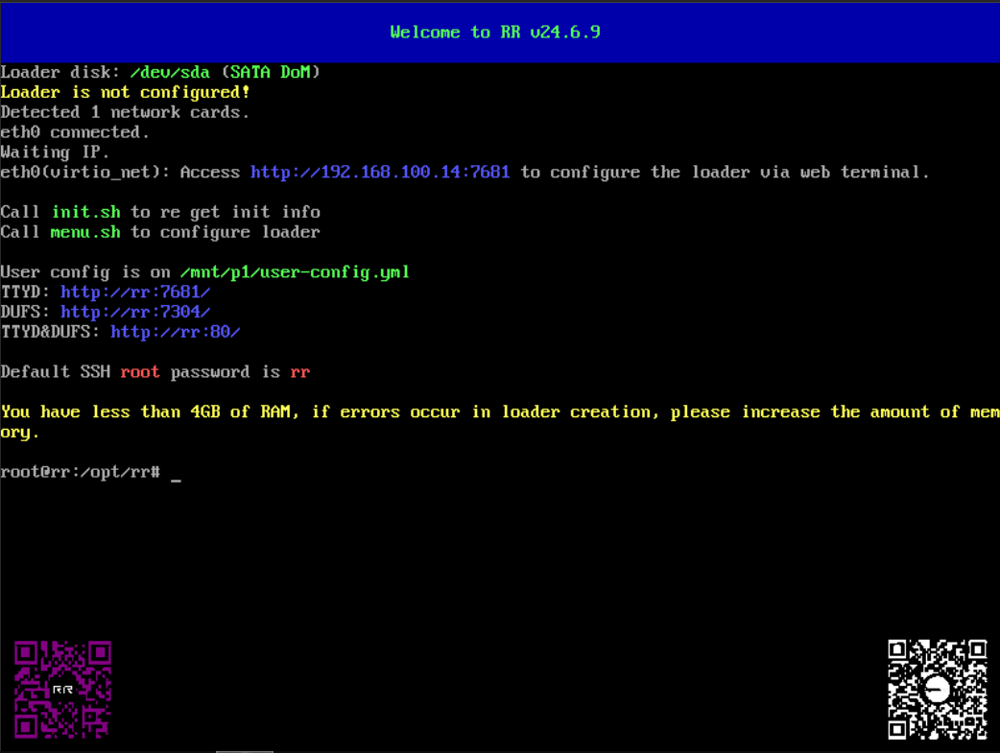

- 输入menu.sh命令进行黑群晖系统安装：

  - 进入设置中更改语言为中文：

    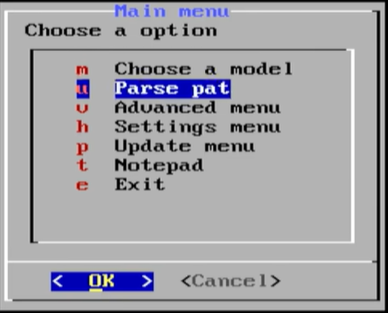

    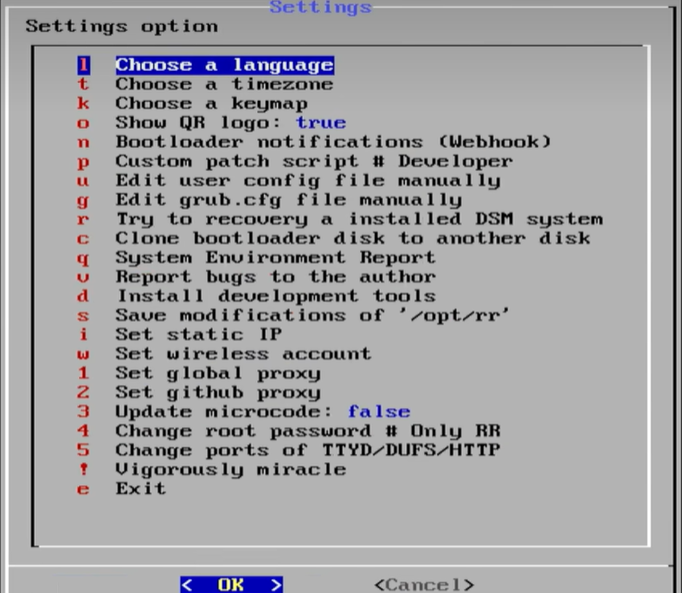

    

  - 确定自己的需要安装的群晖型号和版本：

    - 型号：DS918+
    - 版本：7.2
    - Pat版本：7.2.1-69507-1

  - 此时观察可发现，MD5全为0，后续如果直接编译，那么就会造成MD5检测失败，因此需要进行以下步骤：

    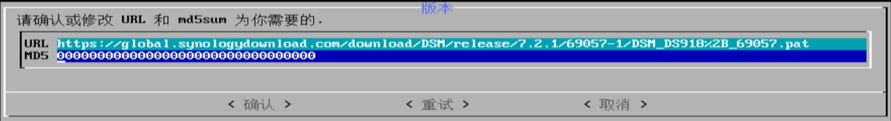

    - 前往群晖官网下载上面型号和版本对应的Pat，其他型号和版本的则按照官网的下载指引一步一步找就行

    - 下载DSM_DS918+_69057.pat文件：[Synology Archive Download Site - Index of /download/Os/DSM/7.2.1-69057-1-NanoPacked](https://archive.synology.cn/download/Os/DSM/7.2.1-69057-1-NanoPacked)

    - 下载Gtkhash工具：[Releases · gtkhash/gtkhash](https://github.com/gtkhash/gtkhash/releases)并使用此工具对上面的文件进行MD5计算，将下面的东西手动填写到MD5框内即可

      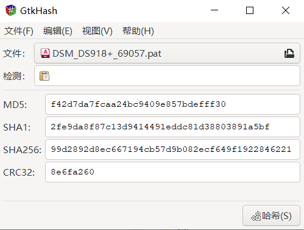

  - 进行安装编译等待其完成。

    

  - 编译完成后，点击启动：

    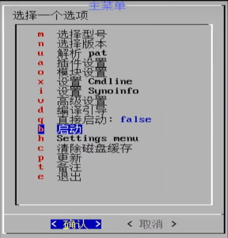

### 第二章	管理信息

- 地址：192.168.100.11:5000

### 第三章	系统初始化

- 在浏览器输入Nas的地址，点击安装

  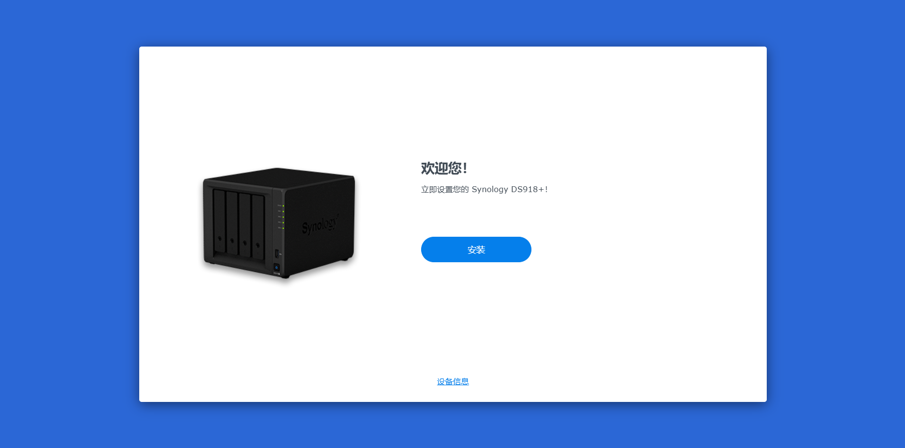

- 选择手动上传Pat文件：

  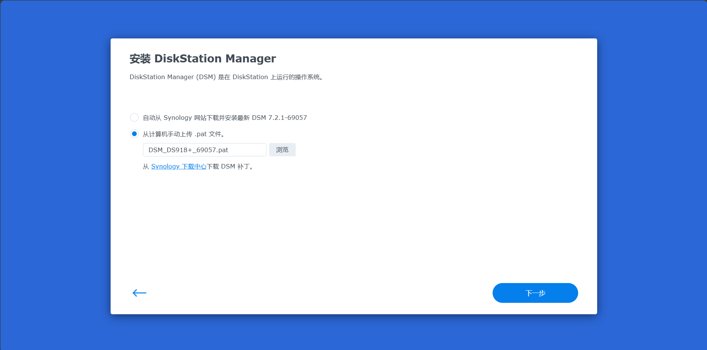

- 输入NAS的型号，以确认将sata盘清空作为NAS存储盘，等待安装：

  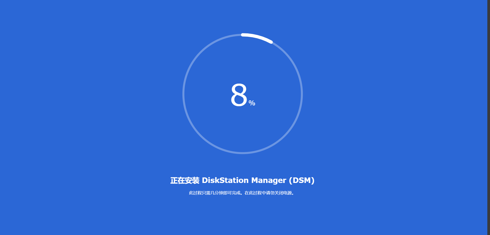

- 安装完成后进行相关配置：记得跳过各种收集服务和线上账号登陆

  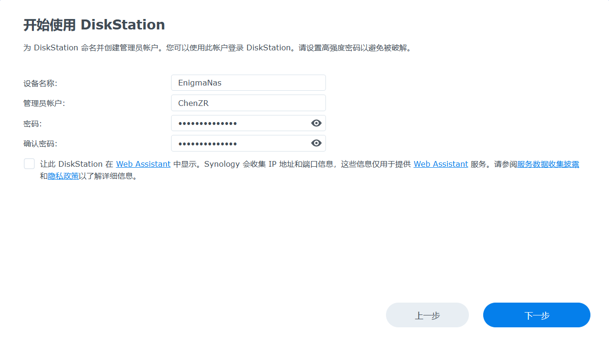

  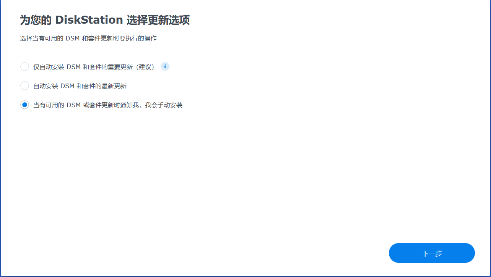

  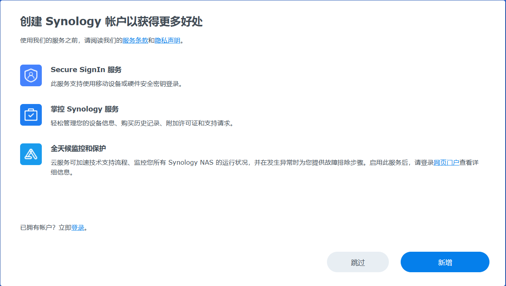

  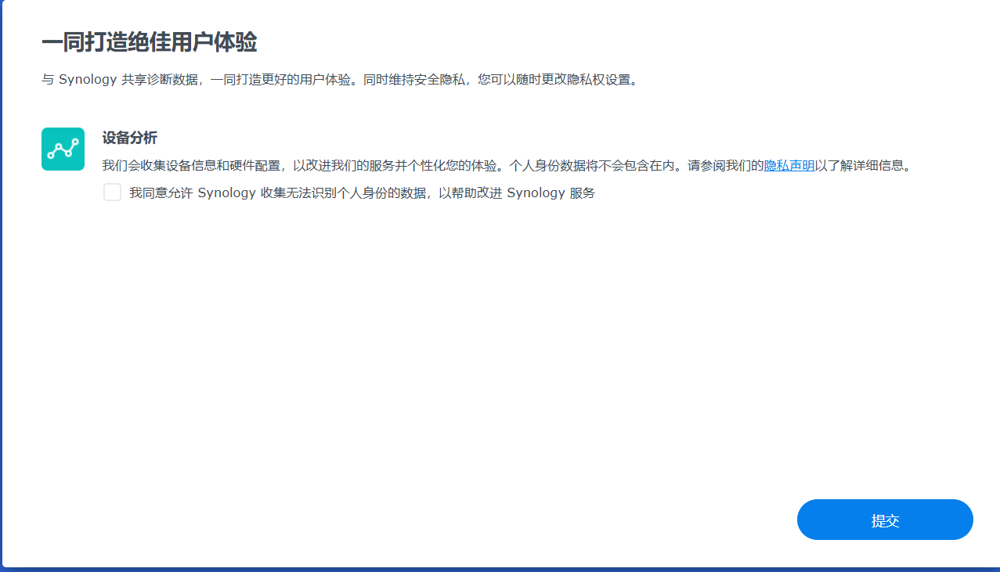

## 第二部分	黑群晖使用

### 第一章	软件说明

- 套件中心：群晖系统的应用商店，可依据实际情况自行安装。
- 
