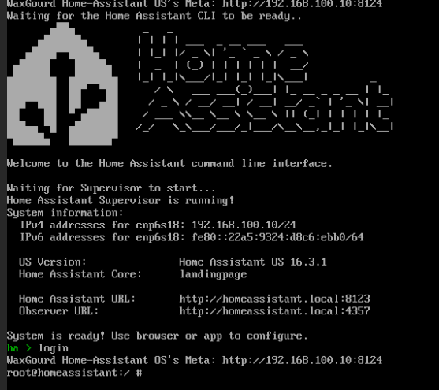

# EnigmaHomeAssistant

----

## 系列文章



---

## 第一部分	HomeAssistant

### 第一章	系统安装

- HAOS镜像：[【新提醒】pe安装x86原生HAOS的方法（虚拟机可用）内有PVE安装教程(12.4) - 『冬瓜HA』专区 - 『瀚思彼岸』» 智能家居技术论坛 - Powered by Discuz! (hassbian.com)](https://bbs.hassbian.com/thread-24143-1-1.html)

- 下载镜像后将其上传至PVE系统，创建HomeAssistantOS虚拟机：

  ```
  常规页面：
  	节点：PVE
  	资源池：默认
  	VM ID：101
  	名称：HAOS
  操作系统页面：
  	选择使用CD/DVD光盘映像文件（ISO）
  		存储：local
  		类别：linux
  		ISO镜像：选择前一步上传的haos系统镜像
  		版本：6.x-2.6 kernel
  系统页面：
  	显卡：默认
  	SCSI控制器：默认
  	机型：q35
  	Qemu代理：不选择
  	BIOS：UEFI【重点】
  	添加EF磁盘：不勾选【重点】
  	添加TPM：不选择
  磁盘：	
  	更改磁盘大小为100GB
  	磁盘格式：SATA【重点】
  	其余选项默认
  CPU：
  	插槽：1
  	类别：host
  	核心：根据自己主机CPU进行选择，N100为4核CPU，因此这里我设置为4
  内存：4096
  网络页面：
  	所有选项默认即可
  ```

- 打开虚拟机控制台，进入win10系统，右键桌面上自带的脚本，根据提示输入1安装Haos，安装完成后关机。

- 打开HAOS----硬件----删除CD/DVD硬件。

- 打开HAOS----选项----QEMU Guest Agent----启用

- 打开控制台启动虚拟机，大概需要等待上二十多分钟，等待HomeAssistant标识出现

  

  ```shell
  #登陆
  login
  #haos开始后台安装
  #输入下面的指令查看安装进度
  ha-install -t
  #安装完成后，重启
  ha host reboot
  ```

- 可以在HAOS虚拟机的概要中看到其IP地址，根据IP地址我们就可以登陆到HAOS的管理页面。

### 第二章	管理信息

- HomeAssistant地址：192.168.100.10
- HomeAssistant用户：chenzr
- 端口：
  - 8123：系统的管理界面端口
  - 4357：系统的日志端口
  - 7681：系统的命令行端口

### 第三章	系统初始化

- 登录8123页面，选择创建我的智能家居
- 输入用户信息：姓名、用户名、密码
- 设置家的位置
- 设置地区为：中国
- 诊断信息默认不发送
