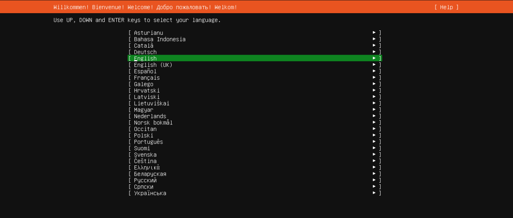
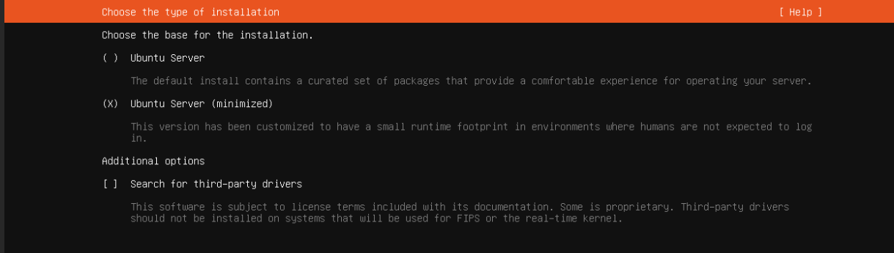
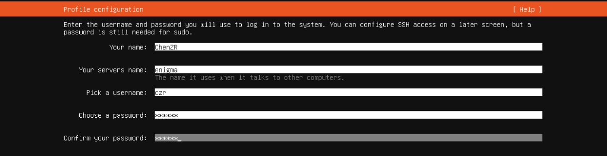

# EnigmaPVE

----

## 系列文章



---

## 第一部分	Ubuntu系统

### 第一章	系统安装

- 前往[Get Ubuntu | Download | Ubuntu](https://ubuntu.com/download)下载Ubuntu服务器LTS版本
- 下载镜像后上传至PVE，创建虚拟机：

  ```
  常规页面：
  	节点：PVE
  	资源池：默认
  	VM ID：101
  	名称：Server
  操作系统页面：
  	选择使用CD/DVD光盘映像文件（ISO）
  		存储：local
  		类别：linux
  		ISO镜像：选择前一步上传的haos系统镜像
  		版本：6.x-2.6 kernel
  系统页面：
  	显卡：默认
  	SCSI控制器：默认
  	机型：q35
  	Qemu代理：不选择
  	BIOS：默认
  	添加TPM：不选择
  磁盘：	
  	更改磁盘大小为120GB
  	磁盘格式：SATA【重点】
  	其余选项默认
  CPU：
  	插槽：1
  	类别：host
  	核心：根据自己主机CPU进行选择，N100为4核CPU，因此这里我设置为4
  内存：4096
  网络页面：
  	所有选项默认即可
  ```
  
- 语言选为：英语

  

- 下载器更新：否

- 键盘布局：都是英文US

- 下载方式：选择最小化系统，方便后续自行配置

  

- 网卡配置和源配置：默认即可

- 分区：默认即可

- 用户名和密码：

  

- 后续一路Done即可。

### 第二章	基本软件安装

- 软件更新：

  ```shell
  sudo apt install update
  sudo apt install upgrade
  ```

- 基本软件：

  ```shell
  sudo apt install vim
  sudo apt install git
  sudo apt install build-essential
  sudo apt install net-tools
  ```


### 第三章	ROS2系统安装

1. 输入以下指令进行安装：

   ```shell
   wget http://fishros.com/install -O fishros && . fishros
   ```

2. 显示以下内容：

   ```
   已为您切换语言至当前所在国家语言:zh_CN
   基础检查通过...
   ===============================================================================
   ======欢迎使用一键安装工具，人生苦短，三省吾身，省时省力省心!=======
   ======一键安装已开源，请放心使用：https://github.com/fishros/install =======
   ===============================================================================
   
   
                           .-~~~~~~~~~-._       _.-~~~~~~~~~-.
                       __.'              ~.   .~              `.__
                   .'//     开卷有益        \./     书山有路     \ `.
                   .'// 可以多看看小鱼的文章  | 关注B站鱼香ROS机器人 \ `.
               .'// .-~~~~~~~~~~~~~~-._     |     _,-~~~~~~~~~~~. \`.
               .'//.-"                 `-.  |  .-'                 "-.\`.
           .'//______.============-..   \ | /   ..-============.______\`.
           .'______________________________\|/______________________________`
           ----------------------------------------------------------------------
   RUN Choose Task:[请输入括号内的数字]
   ---众多工具，等君来用---
   ROS相关:
     [1]:一键安装(推荐):ROS(支持ROS/ROS2,树莓派Jetson)
     [3]:一键安装:rosdep(小鱼的rosdepc,又快又好用)
     [4]:一键配置:ROS环境(快速更新ROS环境设置,自动生成环境选择)
     [9]:一键安装:Cartographer(18 20测试通过,16未测. updateTime 20240125)
     [11]:一键安装:ROS Docker版(支持所有版本ROS/ROS2)
     [16]:一键安装：系统自带ROS (！！警告！！仅供特殊情况下使用)
   
   常用软件:
     [2]:一键安装:github桌面版(小鱼常用的github客户端)
     [6]:一键安装:NodeJS环境
     [7]:一键安装:VsCode开发工具
     [8]:一键安装:Docker
     [10]:一键安装:微信(可以在Linux上使用的微信)
     [12]:一键安装:PlateformIO MicroROS开发环境(支持Fishbot)
     [15]:一键安装：QQ for Linux
   
   配置工具:
     [5]:一键配置:系统源(更换系统源,支持全版本Ubuntu系统)
     [13]:一键配置:python国内源
     [17]:一键配置: Docker代理(支持VPN+代理服务两种模式)
   
   [0]:quit
   ```

3. 按下1进行ROS2安装：

   ```shell
   =========接下来这一步很很很很重要，如果不知道怎么选请选择1========
   RUN Choose Task:[请输入括号内的数字]
   新手或首次安装一定要一定要一定要换源并清理三方源，换源!!!系统默认国外源容易失败!!
   [1]:更换系统源再继续安装
   [2]:不更换继续安装
   [0]:quit
   请输入[]内的数字以选择:
   ```

4. 按下1更换系统源：

   ```shell
   RUN Choose Task:[请输入括号内的数字]
   请选择换源方式,如果不知道选什么请选2
   [1]:仅更换系统源
   [2]:更换系统源并清理第三方源
   [0]:quit
   ```

5. 按下2更换系统源并清理第三方源：

   ```shell
   源选择方式说明:
   1. 自动测速选择最快的源: 系统将自动测试各个源的速度，并选择最快的源
   2. 根据测速结果手动选择源: 系统将测试各个源的速度，然后让您从测试结果中选择
   RUN Choose Task:[请输入括号内的数字]
   请选择源的选择方式
   [1]:自动测速选择最快的源
   [2]:根据测速结果手动选择源
   [0]:quit
   ```

6. 按下1选择自动测速选择最快的源：

   ```shell
   检测到当前系统:ubuntu 架构:amd64 代号:noble,正在为你搜索适合的源...
   搜索到可用源:['https://mirrors.tuna.tsinghua.edu.cn/ubuntu', 'https://mirror.sysu.edu.cn/ubuntu/', 'https://mirrors.ustc.edu.cn/ubuntu', 'https://archive.ubuntu.com/ubuntu', 'https://mirrors.kernel.org/ubuntu', 'http://mirrors.tuna.tsinghua.edu.cn/ubuntu', 'http://mirror.sysu.edu.cn/ubuntu/', 'http://mirrors.ustc.edu.cn/ubuntu', 'http://archive.ubuntu.com/ubuntu', 'http://mirrors.kernel.org/ubuntu']
   接下来将进行自动测速以为您选择最快的源:
   - https://mirrors.tuna.tsinghua.edu.cn/ubuntu           延时:0.23s
   - https://mirror.sysu.edu.cn/ubuntu/            延时:5.38s
   - https://mirrors.ustc.edu.cn/ubuntu            延时:0.19s
   - https://archive.ubuntu.com/ubuntu             延时:0.92s
   
   RUN Choose Task:[请输入括号内的数字]
   检测到您的系统支持多个ROS镜像源，请选择您想要使用的ROS镜像源(默认清华)：
   [1]:中科大镜像源 (推荐国内用户使用)
   [2]:清华镜像源 (容易被封禁)
   [3]:华为镜像源
   [4]:中山大学开源软件镜像站 (试运行)
   [5]:ROS官方源 (国外用户或需要最新版本时使用)
   [0]:quit
   ```

7. 按下1选择中科大镜像源：

   ```shell
   RUN Choose Task:[请输入括号内的数字]
   请选择你要安装的ROS版本名称(请注意ROS1和ROS2区别):
   [1]:jazzy(ROS2)
   [2]:kilted(ROS2)
   [3]:rolling(ROS2)
   [0]:quit
   ```

8. 输入1选择jazzy版本：

   ```
   RUN Choose Task:[请输入括号内的数字]
   请选择安装的具体版本(如果不知道怎么选,请选1桌面版):
   [1]:jazzy(ROS2)桌面版
   [2]:jazzy(ROS2)基础版(小)
   [0]:quit
   ```

9. 输入2选择基础版：

   ```
   RUN Choose Task:[请输入括号内的数字]
   请选择安装的具体版本(如果不知道怎么选,请选1桌面版):
   [1]:jazzy(ROS2)桌面版
   [2]:jazzy(ROS2)基础版(小)
   [0]:quit
   ```

   

