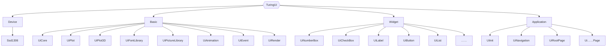

# TuringUi系列(五)

>**CzrTuringB：**在前几篇博客中，我们已经实现了基本元素的绘制和动画函数的编写，接下来我将着重讲解ui框架的实现构想和思路。

## 第一部分	TuringUi架构

### 第一章	文件目录


flowchart TB
	Root{{TuringUi}}
	Root-->Folder1[Device]
	Folder1-->File1[Ssd1306]
	Root-->Folder2[Basic]
	Folder2-->File2[UiCore]
	Folder2-->File3[UiPlot]
	Folder2-->File4[UiPlot3D]
	Folder2-->File5[UiFontLibrary]
	Folder2-->File6[UiPictureLibrary]
	Folder2-->File7[UiAnimation]
	Folder2-->File8[UiEvent]
	Folder2-->File9[UiRender]
	Root-->Folder3[Widget]
	Folder3-->File10[UiNumberBox]
	Folder3-->File11[UiCheckBox]
	Folder3-->File12[UiLabel]
	Folder3-->File13[UiButton]
	Folder3-->File14[UiList]
	Folder3-->File15[……]
	Root-->Folder4[Application]
	Folder4-->File16[UiInit]
	Folder4-->File17[UiNavigation]
	Folder4-->File18[UiRootPage]
	Folder4-->File19[Ui……Page]




- 设备目录：存放显示驱动文件
- Basic目录：
  - UiCore：Ui内核文件
  - UiPlot：二维对象的绘制
  - UiPlot3D：三维对象的绘制
  - UiFontLibrary：字体库
  - UiPictureLibrary：图标库
  - UiAnimation：对象的各种变换与动画实现
  - UiEvent：事件处理器
  - UiRender：渲染器
- Widget目录：存放UI部件
- Application目录：
  - UiInit：Ui初始化
  - UiNavigation：Ui页面树的实现
  - UiRootPage：TuringUi根页面
  - ……：其他应用页面的实现

### 第二章	Ui内核的实现

#### 第一节	硬件随机数生成

```c
/**
  *@ FunctionName: uint32_t UiGetRandom(uint32_t min, uint32_t max)
  *@ Author: CzrTuringB
  *@ Brief: 在指定范围内生成随机数
  *@ Time: Jan 2, 2025
  *@ Requirement：
  */
uint32_t UiGetRandom(uint32_t min, uint32_t max)
{
    if (min > max)  return 0;
    uint32_t randomValue;
    // 获取随机数
    if (HAL_RNG_GenerateRandomNumber(&hrng, &randomValue) != HAL_OK) return 0;
    // 映射到 [min, max] 范围
    return (randomValue % (max - min + 1)) + min;
}
```

#### 第二节	UI元素

- Ui元素是所有Ui部件必须包含的数据结构，其存放了各类部件的公有属性，通过使用函数指针和空指针实现了，各类Ui部件的事件处理、渲染、销毁、动画的函数重载(**这个说法不是很准确**)

- 数据结构：

  ```c
  struct UiElement
  {
  	Bool isHandle;										 // UI元素是否需要处理事件
  	void* widget;										 // 指向UI部件
      void (*render)(UiElement* ele);           		 	 	// 渲染函数
      void (*animation)(UiElement* ele);           		 	// 动画函数
      void (*handleEvent)(UiElement* ele, void* value);  	 	 // 事件处理函数
      void (*destory)(UiElement* ele);					   // 析构函数
  };
  ```

- Ui元素的创建：

  ```c
  /**
    *@ FunctionName: void UiElementCreate(void)
    *@ Author: CzrTuringB
    *@ Brief: 创建一个UI元素
    *@ Time: Jan 9, 2025
    *@ Requirement：
    */
  UiElement* UiElementCreate(void)
  {
  	UiElement* ele = pvPortMalloc(sizeof(UiElement));
  	if(ele == NULL)	return NULL;
  	memset(ele, 0, sizeof(UiElement));
  	return ele;
  }
  ```

- Ui元素的初始化：

  ```c
  /**
    *@ FunctionName: void UiElementInit(UiElement* ele,void* widget, void (*render)(UiElement*), void (*handle)(UiElement*, void*), void (*destory)(UiElement*))
    *@ Author: CzrTuringB
    *@ Brief: 初始化UI元素
    *@ Time: Jan 2, 2025
    *@ Requirement：
    *@ 	1、render即为UI元素渲染函数的指针
    *@ 	2、handle即为UI元素事件处理函数的指针
    */
  void UiElementInit(UiElement* ele, void* widget, void (*render)(UiElement*), void (*handle)(UiElement*, void*), void (*destory)(UiElement*))
  {
  	ele->widget = widget;
  	ele->isHandle = True;
  	ele->render = render;
  	ele->handleEvent = handle;
  	ele->destory = destory;
  	//带动画的UI部件需要单独配置
  	ele->animation = NULL;
  }
  ```

- 销毁：

  ```c
  /**
    *@ FunctionName: void UiElementDestroy(UiElement* ele)
    *@ Author: CzrTuringB
    *@ Brief: 销毁UI页面
    *@ Time: Jan 2, 2025
    *@ Requirement：
    */
  void UiElementDestroy(UiElement* ele)
  {
      if (ele != NULL) vPortFree(ele);
  }
  ```

#### 第三节	Ui页面

- Ui页面：TuringUi框架将应用程序视为由多个UI页面组成，在程序运行声明周期内，有且只有一个页面，即全局变量uiPage(指针)，在发生页面切换时，销毁上个页面的内容，并分配新的内存给创建的页面。

- 数据结构：

  ```c
  //ui页面
  typedef struct
  {
  	Bool haveOngoing;							 // Ui页面是否包含持续事件
  	pTreeNode base;				 				 // Ui页面的基类(指向索引树)
  	uint8_t index;				 				 // Ui页面的索引(用于子节点数组的索引)
      uint8_t eleCount;      		 				  // 当前页面包含的UI元素数量
      Queue elements;   					 		  // 存储页面的所有UI元素
      Queue elesAnimation;						  // 当前页面的UI元素动画队列
      Queue elesRender;							  // 当前页面的UI元素渲染队列
      void (*handleEvent)(UiEvent* event);  	 	    // 事件处理函数
  }UiPage;
  ```

- 页面的创建：

  ```c
  /**
    *@ FunctionName: UiPage* UiPageCreate(void)
    *@ Author: CzrTuringB
    *@ Brief: 动态创建一个UI页面
    *@ Time: Jan 2, 2025
    *@ Requirement：
    */
  UiPage* UiPageCreate(void)
  {
      //动态分配 UiPage 内存
      UiPage* page = pvPortMalloc(sizeof(UiPage));
      if (page == NULL)
      {
          //如果分配失败，返回 NULL
          return NULL;
      }
      memset(page,0,sizeof(UiPage));
      //返回创建的UI页面指针
      return page;
  }
  ```

- 页面的初始化：

  ```c
  /**
    *@ FunctionName: void UiPageInit(UiPage* page, uint8_t count, pTreeNode node,Bool ongoing,void (*handleEvent)(UiEvent*))
    *@ Author: CzrTuringB
    *@ Brief: 初始化UI页面
    *@ Time: Jan 2, 2025
    *@ Requirement：
    *@ 	1、elements即为ui元素指针数组
    *@ 	2、count即为页面包含的ui元素的个数
    *@ 	3、node即为页面所在菜单索引树的节点
    */
  void UiPageInit(UiPage* page, uint8_t count, pTreeNode node,Bool ongoing,void (*handleEvent)(UiEvent*))
  {
      page->eleCount = count;     					// 设置当前元素数量
      page->index = 0;								// 下一级页面的索引
      page->base = node;								// 指定页面所处菜单树的位置
      page->handleEvent = handleEvent;				// 指定页面的事件处理函数
      page->haveOngoing = ongoing;
      //创建一块内存用于存储页面所有元素队列
      UiElement** eleBuffer = (UiElement**)pvPortMalloc(count * sizeof(UiElement*));
      memset(eleBuffer,0,count * sizeof(UiElement*));
      QueueInit(&page->elements, sizeof(UiElement*), count, eleBuffer);
      //创建一块内存用于存储后续需要动画处理的元素
      eleBuffer = NULL;
      eleBuffer = (UiElement**)pvPortMalloc(count * sizeof(UiElement*));
      memset(eleBuffer,0,count * sizeof(UiElement*));
      QueueInit(&page->elesAnimation, sizeof(UiElement*), count, eleBuffer);
      //创建一块内存用于存储后续需要渲染处理的元素
      eleBuffer = NULL;
      eleBuffer = (UiElement**)pvPortMalloc(count * sizeof(UiElement*));
      memset(eleBuffer,0,count * sizeof(UiElement*));
      QueueInit(&page->elesRender, sizeof(UiElement*), count, eleBuffer);
  }
  ```

- 页面的销毁：

  ```c
  /**
    *@ FunctionName: void UiPageDestroy(UiPage* page)
    *@ Author: CzrTuringB
    *@ Brief: 销毁UI页面
    *@ Time: Jan 2, 2025
    *@ Requirement：
    */
  void UiPageDestroy(UiPage* page)
  {
      if (page != NULL)
      {
          if (page->elements.pdQueue != NULL)
          {
              vPortFree((UiElement**)page->elements.pdQueue);
          }
          if (page->elesAnimation.pdQueue != NULL)
          {
              vPortFree((UiElement**)page->elesAnimation.pdQueue);
          }
          if (page->elesRender.pdQueue != NULL)
          {
              vPortFree((UiElement**)page->elesRender.pdQueue);
          }
          //释放UiPage自身的内存
          vPortFree(page);
      }
  }
  ```

- 进入下一级页面【还未实现完全】：

  ```c
  /**
    *@ FunctionName: pTreeNode UiPageEnter(UiPage* page)
    *@ Author: CzrTuringB
    *@ Brief: 进入下一级页面
    *@ Time: Jan 2, 2025
    *@ Requirement：
    */
  pTreeNode UiPageEnter(UiPage* page)
  {
  	pTreeNode node;
  	if(page->base->children == NULL)	return NULL;
  	node = page->base->children[page->index];
  	UiPageDestroy(page);
  	return node;
  }
  ```

- 返回上一级页面【还未实现完全】：

  ```c
  /**
    *@ FunctionName: pTreeNode UiPageQuit(UiPage* page)
    *@ Author: CzrTuringB
    *@ Brief: 返回上一级页面
    *@ Time: Jan 2, 2025
    *@ Requirement：
    */
  pTreeNode UiPageQuit(UiPage* page)
  {
  	pTreeNode node;
  	if(page->base->parent == NULL)	return NULL;
  	node = page->base->parent;
  	UiPageDestroy(page);
  	return node;
  }
  ```

## 第二部分	菜单树

### 第一章	N叉树的实现

- C文件：

  ```c
  /**
    *@ FileName: nTree.c
    *@ Author: CzrTuringB
    *@ Brief: N叉树
    *@ Time: Sep 22, 2024
    *@ Requirement：
    */
  /* Includes ------------------------------------------------------------------*/
  #include "nTree.h"
  /* Data ------------------------------------------------------------------*/
  /* Functions ------------------------------------------------------------------*/
  /**
    *@ FunctionName: pTreeNode CreateNode(void* data, size_t dataSize, InitFunc initFunc)
    *@ Author: CzrTuringB
    *@ Brief: 动态创建一个节点
    *@ Time: Jan 2, 2025
    *@ Requirement：
    */
  pTreeNode CreateNode(void* data, size_t dataSize, InitFunc initFunc)
  {
      //分配节点内存
      pTreeNode node = (pTreeNode)pvPortMalloc(sizeof(TreeNode));
      if (!node)
      {
          //内存分配失败，输出调试信息
          return NULL;
      }
      //分配数据内存并复制数据
      node->data = pvPortMalloc(dataSize);
      if (!node->data)
      {
      	//内存分配失败，输出调试信息
          vPortFree(node);
          return NULL;
      }
      memcpy(node->data, data, dataSize);
      //初始化子节点信息
      node->num = 0;
      node->children = NULL;
      node->parent = NULL;
      //初始化节点的初始化函数指针
      node->initFunc = initFunc;
      //返回节点指针
      return node;
  }
  /**
    *@ FunctionName: void AddChild(pTreeNode parent, pTreeNode child)
    *@ Author: CzrTuringB
    *@ Brief: 添加子节点
    *@ Time: Jan 2, 2025
    *@ Requirement：
    */
  void AddChild(pTreeNode parent, pTreeNode child)
  {
  	//如果形参指针为空，返回或输出打印信息
      if (!parent || !child) return;
      //调整子节点数组大小
      parent->children = (pTreeNode*)pvPortMalloc(sizeof(pTreeNode) * (parent->num + 1));
      if (!parent->children)
      {
          //内存分配失败，输出打印信息
          return;
      }
      // 添加新子节点
      parent->children[parent->num++] = child;
      child->parent = parent;
  }
  /**
    *@ FunctionName: void freeTree(pTreeNode node)
    *@ Author: CzrTuringB
    *@ Brief: 释放树
    *@ Time: Jan 2, 2025
    *@ Requirement：
    */
  void FreeTree(pTreeNode node)
  {
      if (!node) return;
      //递归释放所有子节点
      for (size_t i = 0; i < node->num; i++)
      {
          FreeTree(node->children[i]);
      }
      //释放子节点数组和节点数据
      vPortFree(node->children);
      vPortFree(node->data);
      vPortFree(node);
  }
  ```

- H文件：

  ```c
  /**
    *@ FileName: nTree.h
    *@ Author: CzrTuringB
    *@ Brief: N叉树
    *@ Time: Sep 22, 2024
    *@ Requirement：
    */
  #ifndef __NTREE_H
  #define __NTREE_H
  /* Includes ------------------------------------------------------------------*/
  #include <stdlib.h>
  #include <stdio.h>
  #include <string.h>
  #include "BspState.h"
  #include "FreeRTOS.h"
  #include "task.h"
  /* Data ------------------------------------------------------------------*/
  //Function Pointer
  typedef void (*InitFunc)(void* data, void* params);
  //Struct
  //定义树节点
  typedef struct TreeNode
  {
      void* data;							//指向树节点数据
      InitFunc initFunc;                  //存储初始化函数的指针
      size_t num;							//树节点个数
      struct TreeNode** children; 		//存储一个指向结构体数组的指针
      struct TreeNode* parent;			//存储父节点指针
  }TreeNode, *pTreeNode;
  /* Functions------------------------------------------------------------------*/
  pTreeNode CreateNode(void* data, size_t dataSize, InitFunc initFunc);
  void AddChild(pTreeNode parent, pTreeNode child);
  void FreeTree(pTreeNode node);
  #endif
  ```

### 第二章	菜单树的实现

- 原理：

  ```c
  typedef struct TreeNode
  {
      void* data;							//指向树节点数据
      InitFunc initFunc;                    //存储初始化函数的指针
      size_t num;							//树节点个数
      struct TreeNode** children; 		 //存储一个指向结构体数组的指针
      struct TreeNode* parent;			 //存储父节点指针
  }TreeNode, *pTreeNode;
  ```

  - 一个树节点对应一个Ui页面
  - data指针指向一个字符串，用于表明页面的名称
  - initFunc函数指针指向应用页面的初始化函数，不同的页面需要加载不同的UI元素，因此指向页面的初始化函数方便调用。
  - num存储子节点个数，方便动态创建页面节点。
  - children是一个存储树节点指针的数组的指针。
  - parent指向页面的父节点

- 菜单树初始化：

  ```c
  /**
    *@ FunctionName: void MenuTreeInit(void)
    *@ Author: CzrTuringB
    *@ Brief: 初始化菜单页面索引树
    *@ Time: Jan 2, 2025
    *@ Requirement：
    *@ 	1、这个页面索引树贯穿整个程序生命周期,所以不用销毁分配的空间
    *@ 	2、在程序编写时就要确定好整个UI框架的目录结构，不要再程序运行期间添加节点
    */
  void MenuTreeInit(void)
  {
  	//根页面节点的创建
  	rootNode = CreateNode("root", sizeof("root"), RootPageInit);
  	//向跟页面添加子节点
  //	for(uint8_t i=0; i<rootPage->num; i++)
  //	{
  //		AddChild(rootPage, menu1[i]);
  //	}
  }
  ```

## 第三部分	Ui初始化

>**CzrTuringB：**TuringUi基于FreeRTOS实时操作系统，在程序刚开始运行时会创建一个OledAPP任务，其执行TuringUI的初始化函数后便会被删除。

- OledApp任务：

  ```c
  void OledApp(void)
  {
  	//TuringUi初始化
  	UiInit();
  	//删除当前任务
  	vTaskDelete(NULL);
  	while(1)
  	{
  		;
  	}
  }
  ```

- 初始化流程：

  1. 延时一会，防止刚开始上电SSD1306来不及初始化
  2. 初始化SSD1306
  3. 创建开机动画任务，开机动画播放期间，同步进行后续的初始化
  4. 初始化菜单树
  5. 初始化根页面
  6. 初始化完成后，删除开机动画任务
  7. 创建Ui事件处理任务和Ui渲染任务

- 初始化函数：

  ```c
  /**
    *@ FunctionName: BspState UiInit(UiPage* page)
    *@ Author: CzrTuringB
    *@ Brief: 初始化UI框架
    *@ Time: Oct 30, 2024
    *@ Requirement：
    */
  BspState UiInit()
  {
  	vTaskDelay(pdMS_TO_TICKS(50));		//延时50ms，避免重新上电导致OLED初始化失败
  	SSDInit();							//初始化SSD1306
  	//创建开机动画任务
  	xTaskHandle StartupAnimationHandle;
  	xTaskCreate((void*)StartupAnimation, "StartupAnimation", 128 * 4, NULL, 24, &StartupAnimationHandle);
  	TickType_t time = xTaskGetTickCount();
  	//初始化UI菜单
  	MenuTreeInit();
  	//1、初始化根页面
  	RootPageInit((void*)rootNode, (void*)NULL);
  	//2、开机动画播放时间设置为4s
  	TickType_t nowTime = xTaskGetTickCount();
  	if(nowTime - time < pdMS_TO_TICKS(4000)) vTaskDelayUntil(&time, pdMS_TO_TICKS(4000));
  	vTaskDelete(StartupAnimationHandle);
  	PlotFillScreen(uiDevice->disBuffer, Fill0);
  	SSDUpdateScreen();
  	//3、初始化事件管理器
  	xTaskHandle UiEventTaskHandle;
  	xTaskCreate((void*)UiEventHandle, "UiEvent", 128 * 4, NULL, 24, &UiEventTaskHandle);
  	//4、初始化屏幕渲染器
  	xTaskCreate((void*)UiRenderHandle, "UiRender", 128 * 4, NULL, 24, &UiRenderTaskHandle);
  	return BspOk;
  }
  ```

- 开机动画的设计[^1]：

  ```c
  /**
    *@ FunctionName: void StartupAnimation(void)
    *@ Author: CzrTuringB
    *@ Brief: 开机动画
    *@ Time: Oct 30, 2024
    *@ Requirement：
    */
  void StartupAnimation(void)
  {
  	float attribute[3];								//创建动作因子
  	uint8_t fillMode[11] = {8,3,5,2,6,3,4,2,7,3,1};	//外边框填充模式的变化规律
  	AnimType anit;									//创建动画类型
  	AnimTypeInit(&anit,aEasingInOut);				//动画类型设置为缓入换出
  	MoveScale scale[3] = {{0,60},{0,160},{0,10}};	//设置动画的起始位置和结束位置：内圆弧旋转角度、外圆弧旋转角度，边框动作模式
  	AnimElement anie[3];
  	for(uint8_t i=0;i<3;i++)
  	{
  		//初始化动画元素
  		AnimElementInit(&anie[i], &anit, &scale[i], &attribute[i]);
  	}
  	AnimSet anis;
  	AnimSetInit(&anis, &anie[0], 3, pdMS_TO_TICKS(1500));//设置动画时间为1.5s
  	while(1)
  	{
  		PlotCleanBuffer(uiDevice->disBuffer);
  		PlotString((Point2D){46,28}, "Turing", C6x8, uiDevice->disBuffer);
  		PlotArcRectangle((Point2D){0,0}, 127, 63, 8, uiDevice->disBuffer, (FillMode)fillMode[(uint8_t)attribute[2]]);
  		PlotRingWithRoundedEnds((Point2D){64,32}, 22, 20, uiDevice->disBuffer, 0+attribute[1], 150+attribute[1], FillB);
  		PlotRingWithRoundedEnds((Point2D){64,32}, 22, 20, uiDevice->disBuffer, 180+attribute[1], 330+attribute[1], FillB);
  		PlotRingWithRoundedEnds((Point2D){64,32}, 28, 24, uiDevice->disBuffer, 0+attribute[0], 90+attribute[0], Fill5);
  		PlotRingWithRoundedEnds((Point2D){64,32}, 28, 24, uiDevice->disBuffer, 120+attribute[0], 210+attribute[0], Fill5);
  		PlotRingWithRoundedEnds((Point2D){64,32}, 28, 24, uiDevice->disBuffer, 240+attribute[0], 330+attribute[0], Fill5);
  		Animation(&anis);
  		SSDUpdateScreen();
  		AnimBidirectionalLoop(&anis, 3);
  	}
  }
  ```

## 第四部分	Ui事件管理器【还未实现加锁】

- 事件管理机制：创建了一个以UiEvent结构体变量为元素的FreeRTOS队列，其他外设任务可以向队列中发送UiEvent，事件处理任务在接收到队列中的事件信号后就会进行相应的处理。

- 数据类型：

  ```c
  typedef enum
  {
  	EventOngoing,		   //持续触发事件
  	EventButton,		   //按键事件
      EventTerminal,		   //终端事件
  }EventType;
  typedef struct
  {
  	EventType	type;	//存储事件类型
  	uint8_t id;			//存储事件ID，用于分辨不同外设的同类型事件，如多个按键的单击事件；
  	void* data;			//存储事件携带的数据
  }UiEvent;
  ```

- 事件队列初始化：

  ```c
  /**
    *@ FunctionName: void EventManagerInit(void)
    *@ Author: CzrTuringB
    *@ Brief: 事件管理器初始化
    *@ Time: Jan 10, 2025
    *@ Requirement：
    */
  void EventManagerInit(void)
  {
  	//创建事件消息队列
  	eventQueue = xQueueCreate(EventQueueSize, sizeof(UiEvent));
  }
  ```

- 事件的投递：

  ```c
  /**
    *@ FunctionName: BaseType_t PostUiEvent(UiEvent* event)
    *@ Author: CzrTuringB
    *@ Brief: 事件的发送
    *@ Time: Jan 10, 2025
    *@ Requirement：
    */
  BaseType_t PostUiEvent(UiEvent* event)
  {
      return xQueueSendToFront(eventQueue, event, portMAX_DELAY);
  }
  ```

- 事件任务函数：

  ```c
  /**
    *@ FunctionName: void UiEventHandle(void)
    *@ Author: CzrTuringB
    *@ Brief: TuringUi的事件管理任务函数
    *@ Time: Jan 6, 2025
    *@ Requirement：
    */
  void UiEventHandle(void)
  {
  	EventManagerInit();
  	UiEvent event;
  	while(1)
  	{
  		//接收其他任务发送的事件
          if (xQueueReceive(eventQueue, &event, portMAX_DELAY) == pdTRUE)
          {
          	//执行页面的事件处理函数
          	uiPage->handleEvent(&event);
          	//每执行完一个事件，释放事件数据
          	vPortFree(event.data);
          }
  	}
  }
  ```

## 第六部分	Ui渲染器

- 渲染任务处理函数：

  ```c
  /**
    *@ FunctionName: void UiEventHandle(void)
    *@ Author: CzrTuringB
    *@ Brief: TuringUi的事件管理任务函数
    *@ Time: Jan 6, 2025
    *@ Requirement：
    */
  void UiRenderHandle(void)
  {
  	UiElement* ele;
  	while(1)
  	{
           //动画计算
  		while(uiPage->elesAnimation.count)
  		{
  			QueueOutElement(&uiPage->elesAnimation, &ele);
  			//调用UI部件的动画处理函数进行计算
  			ele->animation(ele);
  		}
          //渲染绘制
  		while(uiPage->elesRender.count)
  		{
  			QueueOutElement(&uiPage->elesRender, &ele);
  			//调用UI部件的渲染处理函数进行计算
  			ele->render(ele);
  		}
          //页面上的持续事件
  		if(uiPage->haveOngoing == True)
  		{
  			UiEvent event;
  			event.type = EventOngoing;
  			event.id = 0;						  //表示持续动画事件
  		    event.data = NULL;
  		    PostUiEvent(&event); 				   //确保事件被发送
  		}
  		SSDUpdateScreen();
  	}
  }
  ```

## 第七部分	页面设计

### 第一章	页面初始化示例

```c
/**
  *@ FunctionName:  void RootPageInit(void* data, void* params)
  *@ Author: CzrTuringB
  *@ Brief: 根页面初始化
  *@ Time: Jan 10, 2025
  *@ Requirement：
  */
void RootPageInit(void* data, void* params)
{
	//创建Ui页面
	uiPage = UiPageCreate();
	//创建并初始化UI元素
	NumberBoxStruct* nBox = NumberBoxCreate();
	NumberBoxInit(nBox, &fontsize, (Point2D){10,40},NumBoxSetUint8, NumBoxUiStyle3, (void*)&x);
	CheckBoxStruct* cBox = CheckBoxCreate();
	CheckBoxInit(cBox, &y, &z, (Point2D){10,20}, CheckBoxUiStyle2);
	LabelStruct* label = LabelCreate();
	LabelInit(label, &fontsize, (Point2D){10,30}, "Hello,I am CzrTuringB", LabelUiStyle2);
	LabelAnimInit(label, 20, 8, LabelAnimation);
	//初始化Ui页面
	UiPageInit(uiPage, 3, (pTreeNode)data, True, RootPageEventHandle);
	//将UI部件包含的UI元素指针存储到到UI界面中
	QueueInElement(&uiPage->elements, &(nBox->base));
	QueueInElement(&uiPage->elements, &(cBox->base));
	QueueInElement(&uiPage->elements, &(label->base));
	//将需要动画计算的UI元素包含到动画队列中
	QueueInElement(&uiPage->elesAnimation, &(label->base));
	//将需要渲染绘制的UI元素包含到渲染队列中
	QueueInElement(&uiPage->elesRender, &(nBox->base));
	QueueInElement(&uiPage->elesRender, &(cBox->base));
	QueueInElement(&uiPage->elesRender, &(label->base));
}
```

### 第二章	页面事件处理函数

```c
/**
  *@ FunctionName: void RootPageEventHandle(UiEvent* event)
  *@ Author: CzrTuringB
  *@ Brief: 页面事件处理器
  *@ Time: Jan 2, 2025
  *@ Requirement：
  */
void RootPageEventHandle(UiEvent* event)
{
	UiElement* ele;
	//根据事件进行处理
	if(event->type == EventButton)
	{
		if(event->id == 0)
		{
			if(*(ButtonState*)event->data == SHORT_PRESS)
			{
				x+=5;
				QueueGetElementAt(&uiPage->elements, 0, &ele);
				ele->handleEvent(ele,(void*)&x);
				QueueInElement(&uiPage->elesRender, &ele);
			}
			if(*(ButtonState*)event->data == DOUBLE_PRESS)
			{
				y = Disable;
				QueueGetElementAt(&uiPage->elements, 1, &ele);
				ele->handleEvent(ele,(void*)&y);
				QueueInElement(&uiPage->elesRender, &ele);
			}
			if(*(ButtonState*)event->data == LONG_PRESS_END)
			{
				y = Enable;
				QueueGetElementAt(&uiPage->elements, 1, &ele);
				ele->handleEvent(ele,(void*)&y);
				QueueInElement(&uiPage->elesRender, &ele);
			}
		}
		else
		{
			if(*(ButtonState*)event->data == SHORT_PRESS)
			{
				x+=5;
				QueueGetElementAt(&uiPage->elements, 0, &ele);
				ele->handleEvent(ele,(void*)&x);
				QueueInElement(&uiPage->elesRender, &ele);
			}
			if(*(ButtonState*)event->data == DOUBLE_PRESS)
			{
				y = Disable;
				QueueGetElementAt(&uiPage->elements, 1, &ele);
				ele->handleEvent(ele,(void*)&y);
				QueueInElement(&uiPage->elesRender, &ele);
			}
			if(*(ButtonState*)event->data == LONG_PRESS_END)
			{
				y = Enable;
				QueueGetElementAt(&uiPage->elements, 1, &ele);
				ele->handleEvent(ele,(void*)&y);
				QueueInElement(&uiPage->elesRender, &ele);
			}
		}
	}
	if(event->type == EventOngoing)
	{
		QueueGetElementAt(&uiPage->elements, 2, &ele);
		QueueInElement(&uiPage->elesAnimation, &ele);
		QueueInElement(&uiPage->elesRender, &ele);
	}
}
```

### 第三节	页面销毁

```c
/**
  *@ FunctionName: void RootPageDestory(void)
  *@ Author: CzrTuringB
  *@ Brief: 页面注销函数：删除页面中包含的所有动态创建的UI部件
  *@ Time: Jan 2, 2025
  *@ Requirement：
  */
void RootPageDestory(void)
{
	UiElement* ele = NULL;
	while(uiPage->elements.count)
	{
		QueueOutElement(&uiPage->elements, &ele);
		if(ele != NULL)	ele->destory(ele);
	}
	//释放掉页面自身
	UiPageDestroy(uiPage);
}
```


----

## 参考：

[^1]:[OLED缓动动画（七）TuringUi的开机动画_哔哩哔哩_bilibili](https://www.bilibili.com/video/BV1JA6rYWEW6/?spm_id_from=333.999.0.0)
